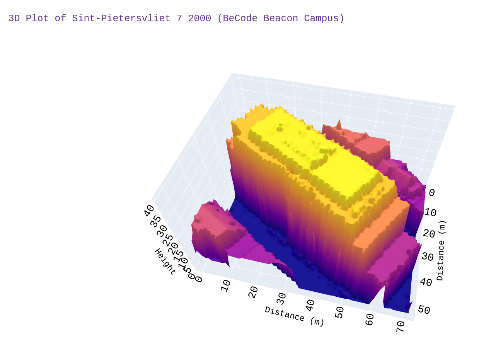

# 3D-house-Project

- Developer: `Louan Mastrogiovanni`
- Type of Challenge: `Learning & Consolidation`
- Duration: `2 weeks`
- Deadline: `25/02/21 5:00 PM`
- Deployment strategy :
	 Github page
	| Powerpoint
	| Jupyter Notebook
	| Webpage
	| App
- Team challenge : `solo`

## Mission Objectives

Consolidate the knowledge in Python, specifically in :

- NumPy
- Pandas
- Matplotlib

## Learning Objectives

* to be able to search and implement new librairies
* to be able to read and use shapefiles
* to be able to read and use geoTIFFs
* to be able to render a 3D plot
* to be able to present a final product

## About the Repository

Geopunt

DTM:http://www.geopunt.be/download?container=dhm-vlaanderen-ii-dtm-raster-1m&title=Digitaal%20Hoogtemodel%20Vlaanderen%20II,%20DTM,%20raster,%201m

DSM: http://www.geopunt.be/download?container=dhm-vlaanderen-ii-dsm-raster-1m&title=Digitaal%20Hoogtemodel%20Vlaanderen%20II,%20DSM,%20raster,%201m

## Challenges

Find the easiest way to get the coordinates from a given address.

## Further Improvements

Merge to a web application

Add an interactive input box

Access the rasters directly without downloading them
